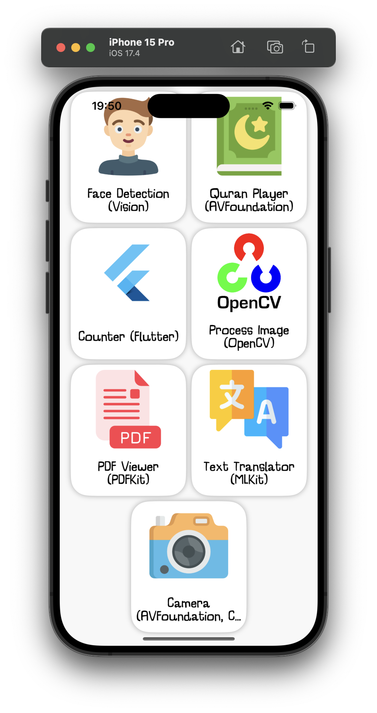
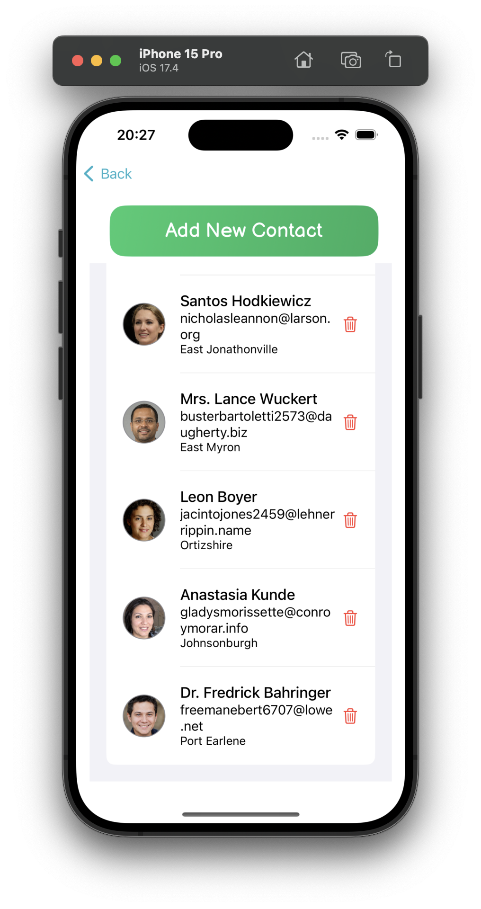
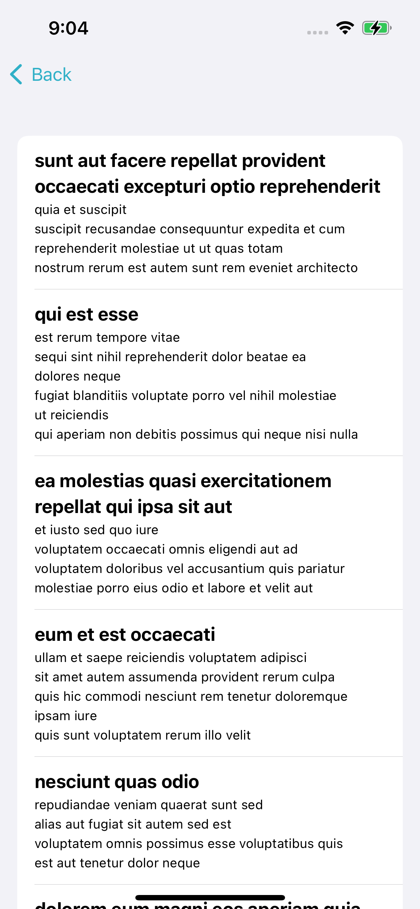
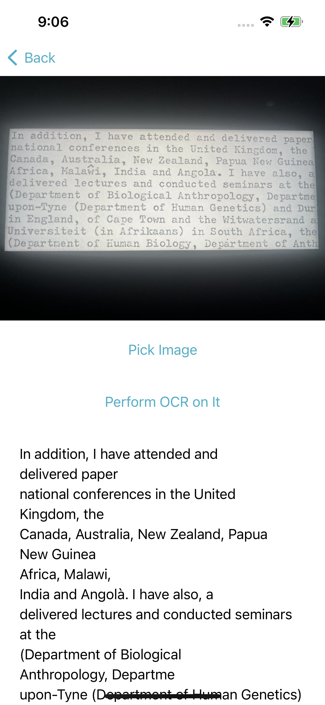
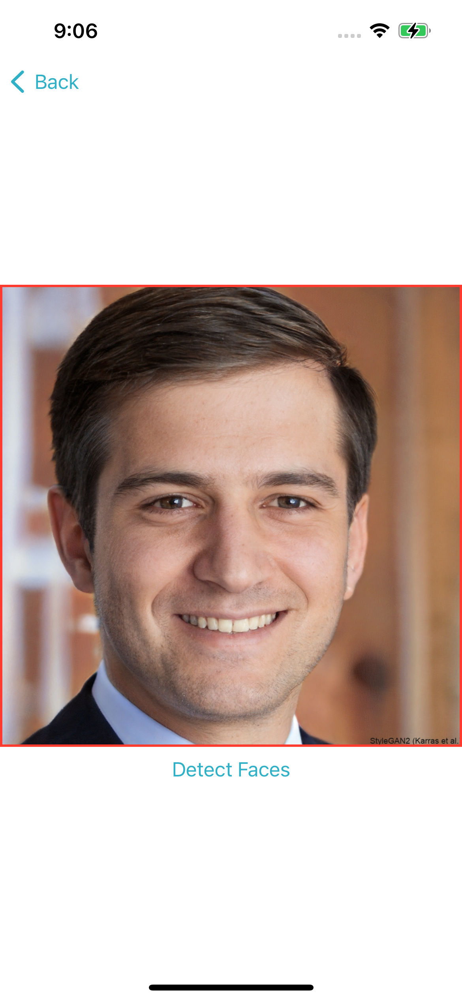
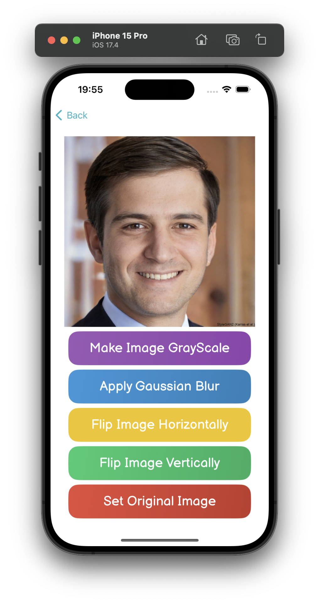
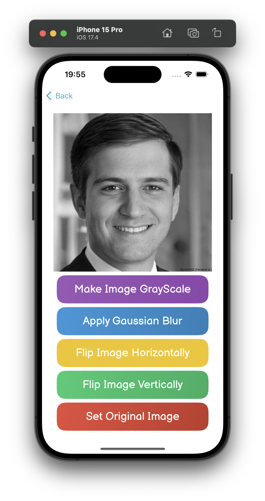
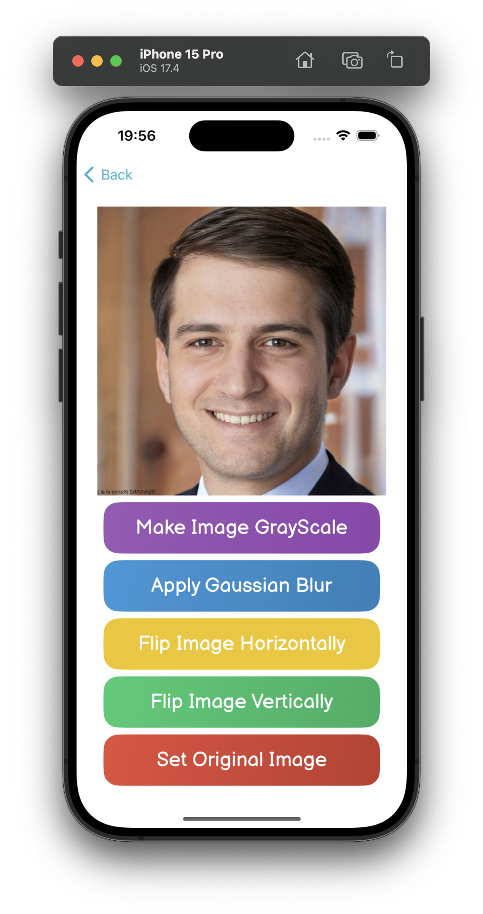
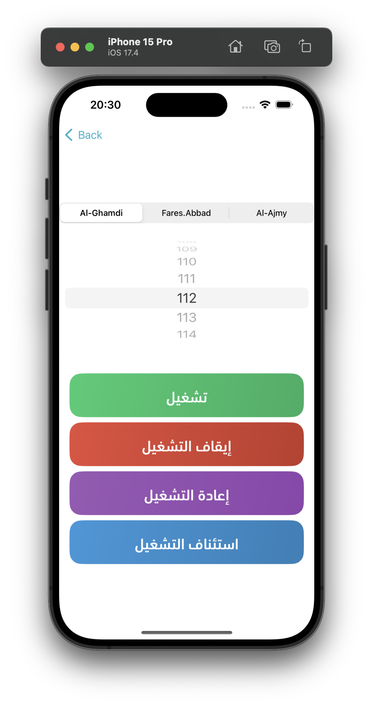

# FulliOS

> An iOS app with many examples (SwiftUI, UIKit, SwiftData, RealmSwift, CoreData, KMM, Flutter, VisionKit, Vision, OpenCV, AVFoundation, PDFKit, MLKit, Combine, RxSwift, CoreML, CryptoKit, HealthKit, and more).


## Prerequisites

- Xcode 15.3
- CocoaPods 1.15.2
- JDK 17
- Flutter 3.22.2
- Tuist 4.22.0

## Examples

### Main App Menu

| Home page (1)               |
|-----------------------------|
|  |


### Contacts List (SwiftUI, SwiftData, Fakery)

| Contacts List                       |
|----------------------------------|
|  |

### Posts List (KMM)

| Posts List                 |
|----------------------------|
|  |

### OCR (SwiftUI, VisionKit)

| Perform OCR on an image    |
|----------------------------|
|  |

### Face Detection (SwiftUI, Vision)

| Face Detection                       |
|--------------------------------------|
|  |

### Process Image (SwiftUI, OpenCV)

| Original Image                   | GrayScale Filter              | Image Flipped Horizontally          | Gaussian Blur      |
| -------------------------------- | -------------------------------- | -------------------------------- |------------------- |
|  |  |  |  |

### Quran Player (SwiftUI, AVFoundation)

| Main Page                          |
|------------------------------------|
|  |

## Setup

```shell
git clone https://github.com/YassineLafryhi/FulliOS.git
cd FulliOS
chmod +x setup.sh
./setup.sh
xed FulliOS.xcworkspace
# Then build and run
```

## Used Tools

| Tool        | Description                                                                                                                                                                                                      |
| ----------- | ---------------------------------------------------------------------------------------------------------------------------------------------------------------------------------------------------------------- |
| SwiftLint   | A tool to enforce Swift style and conventions, helping ensure code quality and consistency.                                                                                                                      |
| SwiftFormat | A code library and command-line tool that automatically formats Swift code, helping maintain a consistent code style and adherence to coding guidelines.                                                         |
| SwiftySpell | A spell checker designed specifically for Swift code, it helps identify all spelling errors.                                                                                                                     |
| SwiftGen    | A Swift code generator for resources, such as images, localized strings, and fonts, which enhances type safety and reduces runtime errors.                                                                       |
| R.swift     | A tool similar to SwiftGen, it generates strong typed references for resources in the project, like images, fonts, and segue identifiers, improving the maintainability and safety of accessing these resources. |
| Periphery   | A tool that identifies unused code in Swift projects. It helps in reducing the codebase size and improving maintainability by detecting and helping to safely remove dead code.                                  |

## Contributing

Contributions are what make the open source community such an amazing place to be learn, inspire, and create. Any contributions you make are **greatly appreciated**.

1. Fork the Project
2. Create your Feature Branch (`git checkout -b feature/AmazingFeature`)
3. Commit your Changes (`git commit -m 'Add some AmazingFeature'`)
4. Push to the Branch (`git push origin feature/AmazingFeature`)
5. Open a Pull Request

## License

[MIT License](https://choosealicense.com/licenses/mit)
